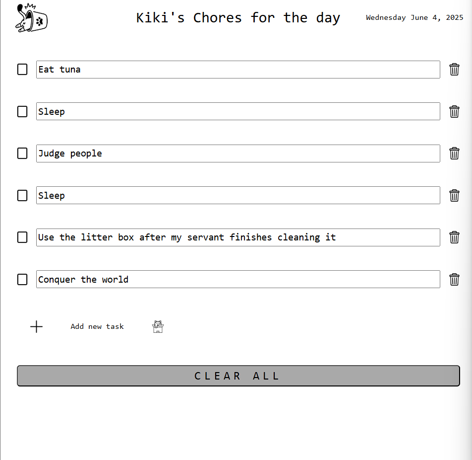

# 🐾 To-Do List for My Cat Chores

A simple and interactive to-do list designed to help you stay on top of your cat care tasks. Whether it’s feeding time, cleaning the litter box, or scheduling vet visits, this app helps you manage everything efficiently — with a touch of purr-sonality. 🐱

## ✨ Features

- ✅ **Add Tasks:** Write down all your cat-related chores in one place.
- 🗑️ **Delete Tasks:** Remove tasks when they’re done or no longer needed.
- 📦 **Persistent Storage:** Tasks are saved in your browser using `localStorage`, so they stay even after refreshing or closing the tab.
- 💡 **Light/Dark Mode Toggle:** Switch between light and dark themes depending on your mood or environment.
- 🎯 **Input Validation:** Prevents empty tasks from being added.
- 🎉 **Clean UI:** Simple, clean layout using custom CSS — no external frameworks.
- ⚡ **Fast & Lightweight:** Pure HTML, CSS, and JavaScript. No frameworks or dependencies.

## 🚀 Getting Started

Just open the `index.html` file in your browser — no setup or installation required.

## 📸 Screenshot

## 📁 Project Structure
📂 project-folder/
├── index.html
├── style.css
└── script.js

## 🛠️ Built With

- HTML5
- CSS3
- Vanilla JavaScript

---

